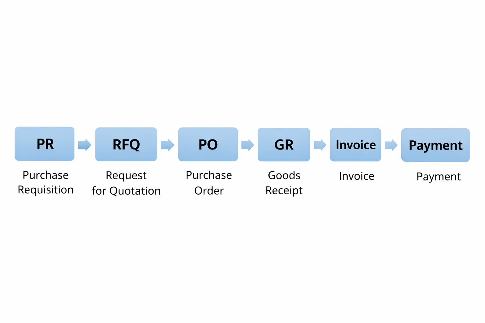

# SAP MM Procure-to-Pay (P2P) Project

## 📌 Overview
This project demonstrates the complete **Procure-to-Pay (P2P)** cycle in **SAP Materials Management (MM)**, covering the full purchasing process from **Purchase Requisition to Vendor Payment**, with seamless integration into **SAP Financial Accounting (FI)**.

The project represents an **end-to-end business process**, showing how organizations automate procurement activities, maintain inventory accuracy, and ensure proper financial postings.

---

## 🔄 End-to-End Process Flow
PR → RFQ → PO → GR → Invoice → Payment

### Process Explanation:
- **Purchase Requisition (ME51N)** – Internal requirement generation  
- **Request for Quotation (ME41/ME47)** – Vendor selection and quotations  
- **Purchase Order (ME21N)** – Official order to vendor  
- **Goods Receipt (MIGO)** – Inventory update and stock posting  
- **Invoice Verification (MIRO)** – 3-way matching (PO–GR–Invoice)  
- **Payment Run (F110)** – Automatic vendor payment  

---

## ⚙️ Modules Used
- **SAP MM (Materials Management)** – Procurement and inventory  
- **SAP FI (Financial Accounting)** – Accounting and payments  

---

## 🧾 Key SAP Transactions
| Transaction Code | Description |
|-----------------|------------|
| ME51N | Purchase Requisition |
| ME41 / ME47 | Request for Quotation |
| ME21N | Purchase Order |
| MIGO | Goods Receipt |
| MIRO | Invoice Verification |
| F110 | Automatic Payment |

---

## 🖼️ Project Visuals

### 📊 Process Flow Diagram

### 📸 SAP Screenshots Included
- Purchase Order Creation (ME21N)  
- Goods Receipt (MIGO)  
- Invoice Verification (MIRO)  
- Payment Run (F110)  

---

## 💰 Financial Integration (FI Flow)

- **Goods Receipt (MIGO)**  
  Dr Inventory A/c → Cr GR/IR Clearing A/c  

- **Invoice Verification (MIRO)**  
  Dr GR/IR Clearing A/c → Cr Vendor A/c  

- **Payment Run (F110)**  
  Dr Vendor A/c → Cr Bank A/c  

👉 This ensures **real-time financial updates and accurate accounting records**.

---

## 📊 Analytics Enhancement (Optional)

As part of SAP Data Analytics Engineering, a small analytics component is included:

### 📁 Files:
- `sample_data.csv` – Sample procurement dataset  
- `p2p_analysis.py` – Basic Python script for analysis  

### 📈 Insights:
- Vendor-wise spending  
- Monthly procurement trends  
- Cost center analysis  

---

## 📂 Project Structure
